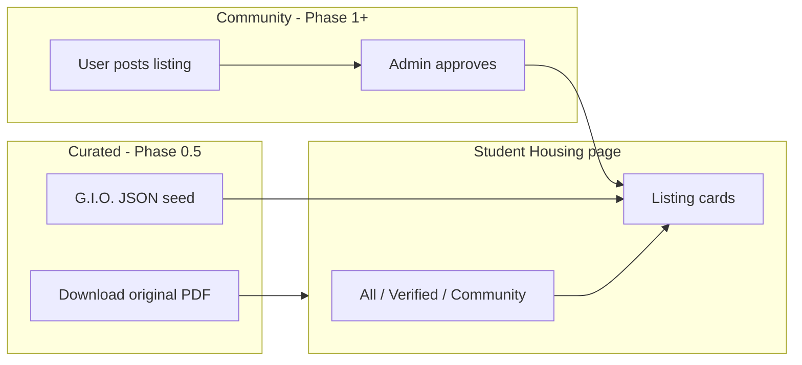

# Student Housing Feature — Product & Technical Plan

> **Status:** Planning (Phase 0 → 0.5)  
> **Platform:** JMI Quiz ([jmiquiz.live](https://jmiquiz.live))  
> **Scope (v1):** JMI only — girls' PGs/hostels in Jamia Nagar  
> **Last updated:** June 2026

---

## 1. Vision

Extend JMI Quiz from an exam-prep platform into a **student life hub** for JMI aspirants and students. The first expansion is **Student Housing** — starting with a **trusted curated list** (G.I.O. Delhi document), then adding **community listings** where owners post their own PGs/hostels, and later **roommate groups**.

**Launch strategy:** Show real, useful data first (G.I.O. list) → then open the platform for user-submitted listings.

### v1 scope (locked for first release)

| Decision | Choice |
|----------|--------|
| University | **JMI only** (AMU later) |
| Audience | **Girls** (first curated doc is G.I.O. girls' list) |
| Area | Jamia Nagar, Okhla, Batla House, Abul Fazal Enclave, etc. |
| First data source | **G.I.O. Delhi** PDF / compiled list (15 hostels/PGs) |
| Seed data file | [`frontend/src/data/gio-jamia-nagar-girls-hostels.json`](../frontend/src/data/gio-jamia-nagar-girls-hostels.json) |

---

## 2. Problem We Solve

| User | Pain point |
|------|------------|
| **Student (seeker)** | Hard to find verified, affordable PG/hostel near campus; scams and broker fees |
| **Owner / landlord** | No targeted channel to reach JMI/AMU students |
| **Student group** | Friends want to share a flat but lack a place to coordinate and post as a group |
| **Platform** | Retain users beyond exam season; build community trust |

---

## 3. Two types of listings (core concept)

Everything on the housing page falls into one of two buckets:

| Type | Source | Who maintains | Contact | Badge on UI |
|------|--------|---------------|---------|-------------|
| **Curated** | Admin-imported (G.I.O., future partners) | Admin re-imports when PDF updates | **Direct** — phone & Google Maps from listing | `Verified list` / `G.I.O. Delhi` |
| **Community** | Logged-in users (owners, students subletting) | Owner edits own listing; admin approves | **Platform-mediated** — see §4 Contact model | `Community listing` |

Both appear on the **same browse page** with a filter: `All` | `Verified lists` | `Community posts`.



---

## 4. Contact model — how people reach each other

This is the most important UX decision. **Curated and community listings behave differently.**

### 4.1 Curated listings (G.I.O. doc) — Phase 0.5

The G.I.O. document already includes **phone numbers and Google Maps links**. These are **third-party contacts** (hostel owners), not JMI Quiz users.

| Action | Behaviour |
|--------|-----------|
| **Call** | `tel:` link — tap to call hostel directly |
| **WhatsApp** | `https://wa.me/91XXXXXXXXXX` — optional quick message |
| **Maps** | Open Google Maps in new tab |
| **No login required** | Public info, same as the PDF |

**Disclaimer on page:** *"Contact details are from G.I.O. Delhi's compiled list. Verify availability and rent in person before paying. JMI Quiz is not affiliated with G.I.O. or these hostels."*

No student-to-student contact on curated listings — seekers contact **hostels only**.

### 4.2 Community listings (user-posted) — Phase 1+

When students or owners post their own listing:

| Step | What happens |
|------|----------------|
| 1 | Seeker opens listing detail page |
| 2 | Clicks **"Contact owner"** (login optional in v1; **recommended: login required** to reduce spam) |
| 3 | Platform reveals contact based on owner's preference |

**Owner contact options (pick one or more when posting):**

| Option | Implementation |
|--------|----------------|
| Phone | Show after button click; log `contactReveal` event |
| WhatsApp | Deep link with pre-filled message: *"Hi, I saw your listing on JMI Quiz..."* |
| Email | Show masked email or send via Brevo relay (Phase 2 — hides real email) |

**We do NOT build in-app chat in Phase 1.** WhatsApp + phone is what students already use. In-app messaging is Phase 4.

### 4.3 Student groups (Phase 3) — contact between students

| Scenario | Contact flow |
|----------|----------------|
| Student wants to join a group | Request to join → creator approves → **group chat link** (WhatsApp group invite) or in-app member list with contact reveal |
| Group posting a "we need a flat" ad | Owners use same **Contact group** button → reaches group creator's phone/WhatsApp |
| Student-to-student without group | Not supported in v1 — use groups feature |

### 4.4 What we never do (safety)

- Do not expose seeker's phone to owners without consent
- Do not allow unauthenticated bulk scraping — rate-limit contact reveals
- Log contact clicks for abuse review
- Show prominent scam warning on every listing

---

## 5. PDF vs structured page

| Approach | Pros | Cons | Recommendation |
|----------|------|------|----------------|
| **Embed PDF only** | Fast to ship | Bad on mobile, no search/filter, poor SEO | ❌ Not primary |
| **Structured page from JSON** | Searchable, mobile-friendly, SEO, filters | Need to type data once | ✅ **Primary UI** |
| **PDF download button** | Users trust original document | — | ✅ **Secondary** — "Download G.I.O. original PDF" |

**Phase 0.5 page layout:**

```
/student-housing
├── Hero: "Girls' PGs & Hostels near JMI (Jamia Nagar)"
├── Attribution: G.I.O. Delhi + Assalamo Alaikum intro text (short)
├── [Download PDF] button → frontend/public/docs/gio-jamia-nagar-hostels.pdf
├── Filters: Availability | Max rent | Area (future)
├── Listing cards (from JSON or DB seed)
└── Footer: Disclaimer + "Want to list your PG? Coming soon"
```

Store PDF at: `frontend/public/docs/gio-jamia-nagar-girls-hostels.pdf` (you upload the file).

---

## 6. Phased Rollout (revised)

### Phase 0 — Planning (done)

| Deliverable | Status |
|-------------|--------|
| This document | ✅ |
| G.I.O. seed JSON (15 listings) | ✅ [`frontend/src/data/gio-jamia-nagar-girls-hostels.json`](../frontend/src/data/gio-jamia-nagar-girls-hostels.json) |

---

### Phase 0.5 — Curated G.I.O. list live (recommended next build)

**Goal:** Ship real value immediately — no user accounts needed for browsing.

| Deliverable | Description |
|-------------|-------------|
| `/student-housing` page | Browse 15 G.I.O. listings from JSON (or static import) |
| Listing detail | Full info: timings, fee, meals, visitors, facilities, availability |
| Contact buttons | Call, WhatsApp, Open in Maps |
| PDF download | Link to hosted PDF copy of G.I.O. document |
| Nav link | "Student Housing" in header |
| SEO | Title: *Girls PG & Hostel near JMI Jamia Nagar* |
| Disclaimer | Platform not affiliated; verify before paying |

**Backend options:**

| Option | When to use |
|--------|-------------|
| **A. Frontend-only JSON import** | Fastest — import JSON in React, no API |
| **B. DB seed + GET API** | Better if admin will edit listings in dashboard later |

**Recommendation:** Start with **Option A**; migrate to **Option B** when admin edit is needed.

**Success criteria:** Students find hostels without downloading a random PDF from WhatsApp.

---

### Phase 1 — Community listings (Browse + Post)

**Goal:** Owners and students can post listings **alongside** the G.I.O. curated list.

#### User stories

- As a **visitor**, I see curated + community listings on one page; I can filter by source.
- As a **logged-in user**, I can create a community listing with photos, rent, amenities, and contact preference.
- As a **listing owner**, I can edit or deactivate my listing.
- As an **admin**, I can approve community listings and update curated imports.

#### Scope

- Listing types: `room`, `pg`, `hostel`
- University: **JMI only** (v1)
- Gender: `female` for curated G.I.O.; community can specify `male`, `female`, `any`
- `listingSource`: `curated` | `community`
- `curatedSource`: e.g. `gio_delhi` (nullable for community)
- Contact: owner chooses phone and/or WhatsApp; revealed on button click
- Status workflow (community only): `pending_review` → `active` → `filled` / `inactive`
- Curated listings: `status: active` always; admin updates via re-seed or admin form

#### Out of scope for Phase 1

- Groups / roommate matching
- In-app chat
- Payments / booking deposits
- Reviews and ratings

---

### Phase 2 — Discovery & trust

**Goal:** Make listings easier to find and safer to use.

| Feature | Details |
|---------|---------|
| **Search & filters** | Distance from campus, furnished, food included, AC, Wi‑Fi, laundry |
| **Saved listings** | Bookmark listings (auth required) |
| **Report listing** | Flag spam/scam; admin queue |
| **Owner verification** | Optional badge after admin checks ID / college ID |
| **Listing analytics** | Views and contact clicks for owners |
| **SEO pages** | `/student-housing/jmi`, `/student-housing/amu` for organic traffic |

---

### Phase 3 — Student groups (roommate matching)

**Goal:** Groups of students can team up to find shared accommodation.

#### User stories

- As a **student**, I can create a **housing group** (e.g. "3 B.Tech students looking for flat near JMI").
- As a **group creator**, I can invite members via link or email; set target size, budget per person, move-in date.
- As a **group**, we can publish one **group listing** visible to owners ("We are 3 students looking for a 3BHK").
- As an **owner**, I can respond to group listings (contact request).
- As a **solo student**, I can browse **open groups** accepting members (with approval from creator).

#### Group model (high level)

```
HousingGroup
  - name, description
  - university, preferredArea
  - members[] (userId, role: creator | member)
  - targetSize, currentSize
  - budgetPerPerson, moveInDate
  - genderPreference
  - status: recruiting | full | closed
  - linkedListingId? (optional group want-ad)
```

#### Out of scope for Phase 3

- Split rent payments inside the app
- Legal lease generation

---

### Phase 4 — Communication & growth

| Feature | Details |
|---------|---------|
| **In-app messaging** | Seeker ↔ owner; group ↔ owner (or use WhatsApp deep link as interim) |
| **Notifications** | Email (Brevo) + optional in-app: new message, listing approved, group invite |
| **Waitlist → launch** | Email users who signed up on coming soon page |
| **Moderation dashboard** | Admin tab: listings, reports, groups |

---

## 4. Data Model (Prisma — target schema)

Planned models to add in Phase 1+. Names are tentative; adjust during implementation.

```prisma
model HousingListing {
  id              Int      @id @default(autoincrement())
  userId          Int?     @map("user_id")          // null for curated
  listingSource   String   @default("community") @map("listing_source") // curated | community
  curatedSource   String?  @map("curated_source")   // gio_delhi, etc.
  listingType     String   @map("listing_type")     // room, pg, hostel
  university      String   @default("JMI")
  genderPreference String  @default("female") @map("gender_preference")
  title           String   @db.VarChar(150)
  description     String?  @db.Text
  address         String   @db.Text
  latitude        Float?
  longitude       Float?
  mapsUrl         String?  @map("maps_url")
  rentMonthly     Float?   @map("rent_monthly")
  feeNotes        String?  @map("fee_notes") @db.Text   // "Rs. 3500 two-seater" free text
  entryTiming     String?  @map("entry_timing")
  meals           String?  @db.Text
  visitors        String?  @db.Text
  amenities       Json     @default("[]")
  images          Json     @default("[]")
  phones          Json     @default("[]")              // ["9899221342", ...]
  contactPhone    String?  @map("contact_phone")       // primary for community
  whatsappNumber  String?  @map("whatsapp_number")
  showContactPublicly Boolean @default(false) @map("show_contact_publicly")
  availability    String?  @db.VarChar(100)          // "Available", "Not Available", etc.
  status          String   @default("pending_review")
  viewCount       Int      @default(0) @map("view_count")
  contactRevealCount Int   @default(0) @map("contact_reveal_count")
  createdAt       DateTime @default(now()) @map("created_at")
  updatedAt       DateTime @updatedAt @map("updated_at")
  // ... relations unchanged
}

model SavedHousingListing {
  id        Int      @id @default(autoincrement())
  userId    Int      @map("user_id")
  listingId Int      @map("listing_id")
  createdAt DateTime @default(now()) @map("created_at")

  user      User            @relation(...)
  listing   HousingListing  @relation(...)

  @@unique([userId, listingId])
  @@map("saved_housing_listings")
}

model HousingReport {
  id        Int      @id @default(autoincrement())
  listingId Int      @map("listing_id")
  userId    Int?     @map("user_id")
  reason    String   @db.VarChar(50)
  details   String?  @db.Text
  status    String   @default("pending") // pending, reviewed, dismissed
  createdAt DateTime @default(now()) @map("created_at")

  listing   HousingListing @relation(...)
  user      User?          @relation(...)

  @@map("housing_reports")
}

// Phase 3
model HousingGroup {
  id               Int      @id @default(autoincrement())
  creatorId        Int      @map("creator_id")
  name             String   @db.VarChar(100)
  description      String?  @db.Text
  university       String
  preferredArea    String?  @map("preferred_area")
  targetSize       Int      @map("target_size")
  budgetPerPerson  Float?   @map("budget_per_person")
  moveInDate       DateTime? @map("move_in_date")
  genderPreference String   @map("gender_preference")
  status           String   @default("recruiting") // recruiting, full, closed
  inviteCode       String   @unique @map("invite_code")
  createdAt        DateTime @default(now()) @map("created_at")
  updatedAt        DateTime @updatedAt @map("updated_at")

  creator          User     @relation(...)
  members          HousingGroupMember[]

  @@map("housing_groups")
}

model HousingGroupMember {
  id        Int      @id @default(autoincrement())
  groupId   Int      @map("group_id")
  userId    Int      @map("user_id")
  role      String   @default("member") // creator, member
  joinedAt  DateTime @default(now()) @map("joined_at")

  group     HousingGroup @relation(...)
  user      User         @relation(...)

  @@unique([groupId, userId])
  @@map("housing_group_members")
}
```

**User model extension (Phase 1):**

```prisma
// Add to existing User model:
housingListings   HousingListing[]
savedListings     SavedHousingListing[]
housingGroups     HousingGroupMember[]
```

---

## 5. API Design (REST)

Mount under `/api/housing` (Phase 1+).

### Public

| Method | Endpoint | Description |
|--------|----------|-------------|
| GET | `/listings` | Paginated list; query: `university`, `type`, `minRent`, `maxRent`, `gender`, `area`, `search` |
| GET | `/listings/:id` | Single listing (increment view count) |

### Authenticated user

| Method | Endpoint | Description |
|--------|----------|-------------|
| POST | `/listings` | Create listing (multipart: images + JSON body) |
| PUT | `/listings/:id` | Update own listing |
| PATCH | `/listings/:id/status` | Mark filled / inactive |
| GET | `/my-listings` | Owner's listings |
| POST | `/listings/:id/save` | Bookmark (Phase 2) |
| DELETE | `/listings/:id/save` | Remove bookmark |
| POST | `/listings/:id/report` | Report listing |

### Admin (`verifyToken` + `isAdmin`)

| Method | Endpoint | Description |
|--------|----------|-------------|
| GET | `/admin/listings` | All listings + filters by status |
| PATCH | `/admin/listings/:id` | Approve / reject / remove |
| GET | `/admin/reports` | Report queue |

### Groups (Phase 3)

| Method | Endpoint | Description |
|--------|----------|-------------|
| POST | `/groups` | Create group |
| GET | `/groups` | Browse open groups |
| GET | `/groups/:id` | Group detail |
| POST | `/groups/join/:inviteCode` | Join via invite |
| POST | `/groups/:id/leave` | Leave group |
| PUT | `/groups/:id` | Update (creator only) |

### Phase 0 only

| Method | Endpoint | Description |
|--------|----------|-------------|
| POST | `/waitlist` | Email signup for coming soon (optional) |

---

## 6. Frontend Structure

```
frontend/src/
├── pages/
│   ├── StudentHousing.jsx          # Phase 0: coming soon
│   ├── HousingBrowse.jsx           # Phase 1: listing grid
│   ├── HousingDetail.jsx           # Phase 1: single listing
│   ├── PostListing.jsx             # Phase 1: create/edit form
│   ├── MyListings.jsx              # Phase 1: owner dashboard
│   ├── HousingGroups.jsx           # Phase 3: browse groups
│   └── MyHousingGroup.jsx          # Phase 3: group management
├── components/housing/
│   ├── ListingCard.jsx
│   ├── ListingFilters.jsx
│   ├── ListingForm.jsx
│   ├── AmenityPicker.jsx
│   ├── ImageUploader.jsx           # reuse Cloudinary pattern from admin QuizForm
│   └── GroupCard.jsx
└── utils/
    └── housingApi.js
```

### Routes (App.jsx)

| Path | Phase | Access |
|------|-------|--------|
| `/student-housing` | 0 | Public — coming soon |
| `/student-housing/browse` | 1 | Public |
| `/student-housing/listing/:id` | 1 | Public |
| `/student-housing/post` | 1 | Auth |
| `/student-housing/my-listings` | 1 | Auth |
| `/student-housing/groups` | 3 | Public browse |
| `/student-housing/groups/:id` | 3 | Auth for members |

### Nav (Header.jsx)

Add after "Ask a Question":

```js
{ name: 'Student Housing', path: '/student-housing' }
```

Phase 0 can show a small "Soon" badge on the link.

---

## 7. Reuse from Existing Codebase

| Existing piece | Reuse for housing |
|----------------|-------------------|
| `AuthContext` + cookies | All authenticated flows |
| `verifyToken` / `verifyAdmin` | Route protection |
| `cloudinary.js` + `multer.js` | Listing photos |
| `Pagination.jsx` | Listing grids |
| `FilterBar.jsx` / `SearchAndSort.jsx` | Patterns for housing filters |
| `MessageAlert.jsx` | Form feedback |
| Admin dashboard tabs | New "Housing" tab for moderation |
| `usePageSeo.js` | SEO for browse pages |
| Brevo email | Waitlist + listing approved notifications |
| Rate limiters | Post listing, report, contact reveal |

---

## 8. Safety & moderation

Housing marketplaces attract scams. Plan for these from Phase 1:

1. **Admin approval** — New listings `pending_review` until approved (configurable: auto-approve for verified owners later).
2. **Rate limits** — Max N new listings per user per day.
3. **Report flow** — Users flag listings; admin reviews.
4. **PII** — Phone numbers optional; log contact reveals for abuse tracking.
5. **Terms** — Extend Terms page: platform is a listing board only, not a party to leases.
6. **Disclaimer on every listing** — "Verify in person before paying."

---

## 9. UI / UX notes

- **Visual identity:** Match existing JMI Quiz (Tailwind, dark mode, Framer Motion).
- **Mobile first:** Most students browse on phone.
- **University toggle:** JMI / AMU at top of browse (like quiz filters).
- **Empty states:** Clear CTAs — "No listings yet? Post yours" / "Create a group".
- **Coming soon page (Phase 0):** Hero, 3 benefit cards (Find / List / Group), waitlist form, link back to quizzes.

---

## 10. Implementation order (checklist)

### Phase 0 — Planning

- [x] Write this plan (`docs/STUDENT_HOUSING_PLAN.md`)
- [x] Parse G.I.O. document into seed JSON
- [ ] Upload G.I.O. PDF to `frontend/public/docs/`

### Phase 0.5 — G.I.O. curated list (next build)

- [ ] `StudentHousing.jsx` — browse page with listing cards
- [ ] `HousingListingDetail.jsx` — full detail + Call / WhatsApp / Maps
- [x] Import from `frontend/src/data/gio-jamia-nagar-girls-hostels.json`
- [ ] PDF download button
- [ ] Route `/student-housing` + nav link in Header
- [ ] Disclaimer + G.I.O. attribution
- [ ] SEO via `usePageSeo`

### Phase 1 — Community listings

- [ ] Prisma migration: `HousingListing`
- [ ] `housing.controller.js` + `housing.route.js`
- [ ] `housingApi.js` + browse/detail/post pages
- [ ] Admin housing moderation tab
- [ ] Image upload flow
- [ ] Terms/disclaimer copy

### Phase 2 — Discovery (~1–2 weeks)

- [ ] `SavedHousingListing`, amenities filters
- [ ] Reports + admin queue
- [ ] SEO landing pages

### Phase 3 — Groups (~2 weeks)

- [ ] `HousingGroup` + `HousingGroupMember` models
- [ ] Group CRUD + invite links
- [ ] Group browse + join flow

### Phase 4 — Polish

- [ ] Messaging or WhatsApp handoff
- [ ] Email notifications
- [ ] Analytics for owners

---

## 11. Open decisions (resolve before Phase 1)

| Question | Decision |
|----------|----------|
| JMI only for v1? | **Yes** |
| Show G.I.O. as PDF or structured page? | **Structured primary**, PDF download secondary |
| Curated contact public? | **Yes** — same as original G.I.O. doc |
| Community contact public? | **No** — reveal on button click; login recommended |
| Student-to-student contact? | **Phase 3** via groups only |
| Auto-approve community listings? | **No** — admin approve first |
| Guest posting? | **No** — login required to post |

---

## 12. Success metrics

| Metric | Target (3 months post Phase 1) |
|--------|--------------------------------|
| Active listings | 50+ |
| Listing views / week | 500+ |
| Posts by students (non-broker) | 30%+ of listings |
| Groups created (Phase 3) | 20+ |
| Scam reports resolved < 24h | 95% |

---

## 13. Naming & branding

Suggested user-facing name: **"Student Housing"** or **"Stay Near Campus"**  
URL slug: `/student-housing` (stable across phases)

Subtitle on coming soon page:

> *Find rooms, PGs, and hostels near JMI & AMU — or list yours. Roommate groups coming soon.*

---

## 14. Related files in repo

| File | Purpose |
|------|---------|
| `backend/prisma/schema.prisma` | Add models in Phase 1+ |
| `backend/routes/index.js` | Mount `/housing` |
| `frontend/src/App.jsx` | New routes |
| `frontend/src/components/Header.jsx` | Nav link |
| `frontend/src/pages/AdminDashboard.jsx` | Housing admin tab |

---

*This document is the single source of truth for the Student Housing feature until Phase 1 kickoff. Update checkboxes and status as phases ship.*
